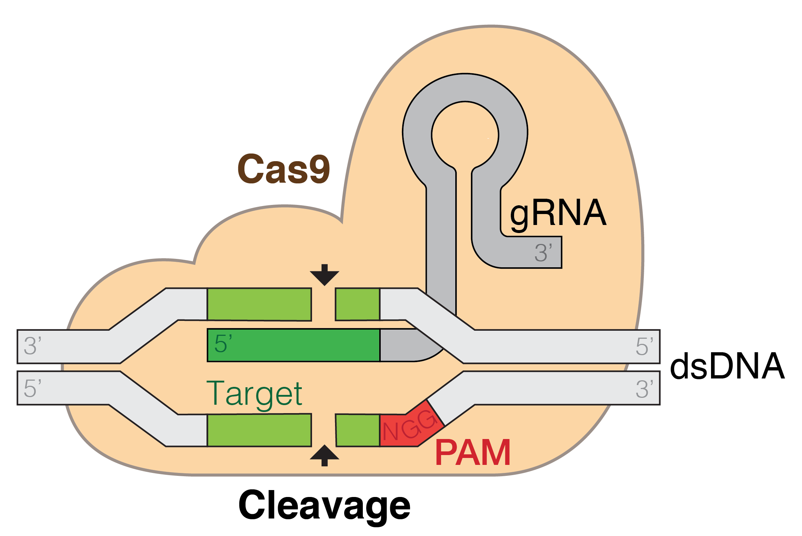

# LearnCRISPR
For Self Learning CRISPR gene editing Information

[image source](https://en.wikipedia.org/wiki/CRISPR_gene_editing#/media/File:GRNA-Cas9.png)

# Usage

synthetic cell 

http://derk-jan.me/programming-life/

# Cartoon

[Endy - Adventures in synthetic biology](http://derk-jan.me/programming-life/downloads/readings/1.%20Endy%20-%20Adventures%20in%20synthetic%20biology.pdf)

# Reference

[wikipedia page - CRISPR gene editing](https://en.wikipedia.org/wiki/CRISPR_gene_editing)

[Azimuth](https://github.com/MicrosoftResearch/Azimuth) - Machine Learning-Based Predictive Modelling of CRISPR/Cas9 guide efficiency. By Microsoft Research
/

biological computers

colored fluorescent protein

https://www.extremetech.com/extreme/232190-how-mits-new-biological-computer-works-and-what-it-could-do-in-the-future

metabolites

[Escherichia coli](https://en.wikipedia.org/wiki/Escherichia_coli)

programmable bacteria

biotechnology 
